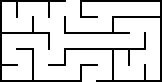
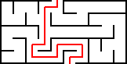

# Ejercicio extra - Laberinto

Diseña un programa para controlar un robot que sea capaz de recorrer este laberinto:

El robot comienza en la abertura que hay en la parte inferior, mirando hacia arriba. Tiene que alcanzar la abertura de la parte superior, como en esta posible solución:

El procesador del robot entiende las siguientes órdenes:

- `adelante()`: Si no está frente a una pared, hace avanzar al robot una casilla.
- `giraIzq()` y `giraDer()`: Hacen girar 90º a izquierda o derecha al robot.
- `hayPared()`: Devuelve `true` (verdadero) si el robot está frente a una pared y no puede avanzar.
- `tocaPared()`: Devuelve `true` si el robot tiene pared a su derecha.
- `salida()`: Devuelve `true` si el robot está en la salida del laberinto.

Notas y sugerencias:

- El robot dispone de dos sensores, uno en el frontal y otro en el lado derecho que le dicen si está en contacto con una pared.
- Debido a limitaciones en el diseño de su motor, el robot sólo puede avanzar un cuadro cada vez.
- El algoritmo de [seguir la pared con la mano](https://en.wikipedia.org/wiki/Maze_solving_algorithm#Wall_follower) puede ser útil para este problema.
- Para poner a prueba el algoritmo, puedes generar más laberintos con [esta herramienta](http://www.mazegenerator.net/).
- El robot no se detiene hasta que encuentre la salida o se le acabe la batería.
- Pulsando en [este enlace](https://blockly-games.appspot.com/maze?lang=es&level=10&skin=0#rkxx8g) puedes ver una solución creada usando [Blockly](https://developers.google.com/blockly/).
